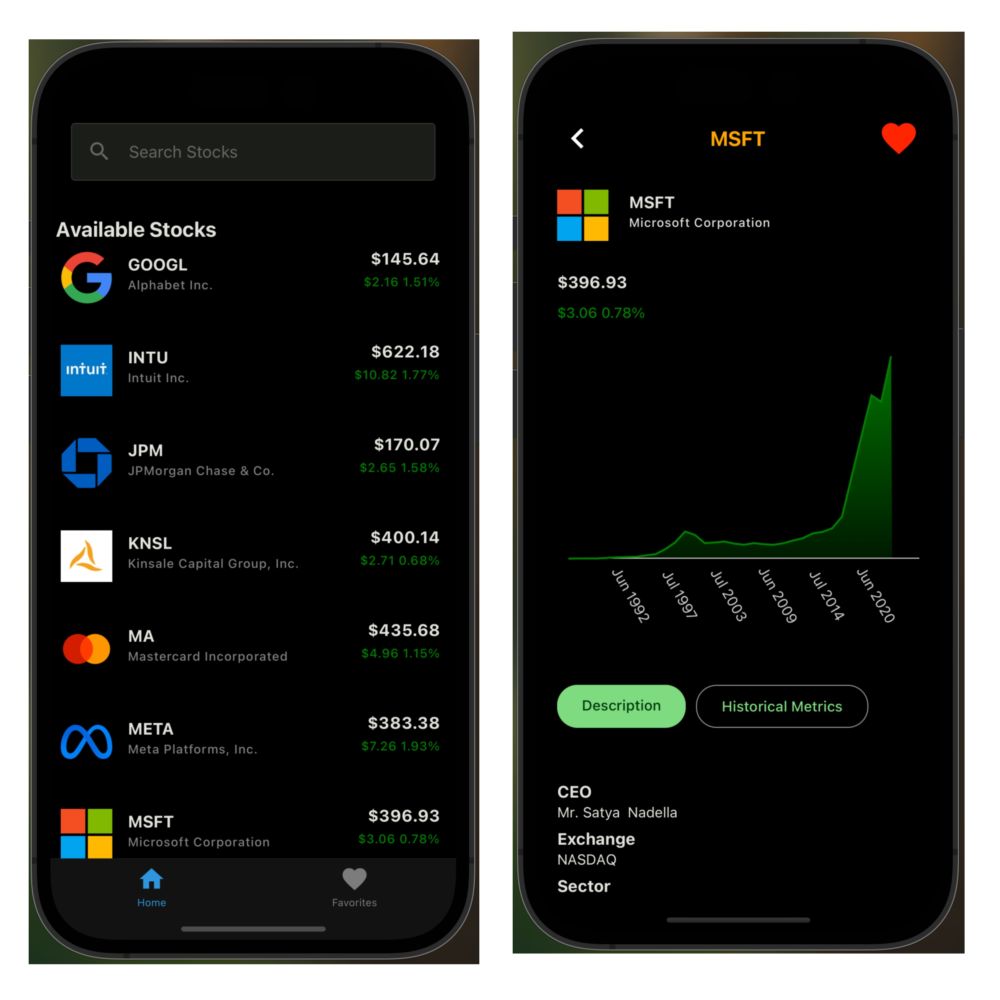

# Stock Market UI - React Native

Bu proje, **React Native** kullanılarak geliştirilmiş bir **Stock Market UI** (Kullanıcı Arayüzü) uygulamasıdır. Bu uygulama yalnızca arayüz (frontend) odaklıdır ve herhangi bir backend veya canlı veri kaynağı ile bağlantısı yoktur. Temel amacı, modern ve şık bir hisse senedi izleme uygulamasının kullanıcı arayüzünü sunmaktır.

## Özellikler

- 🎨 **Şık ve Modern UI**: Hisse senedi fiyatlarını ve grafiklerini kullanıcı dostu bir arayüz ile sunar.
- 📊 **Statik Verilerle Çalışma**: Uygulama sadece statik (dummy) verilerle çalışır. Gerçek zamanlı veri akışı yoktur.
- 📱 **Mobil Uyumlu Tasarım**: Hem Android hem de iOS cihazlarda düzgün çalışacak şekilde optimize edilmiştir.
- 🔍 **Görsel Unsurlar**: Hisse senetlerinin fiyat trendlerini ve performansını görsel olarak sunan grafikler içerir.

## Proje Görüntüsü



## Kurulum ve Çalıştırma

Bu projeyi yerel ortamınızda çalıştırmak için aşağıdaki adımları takip edebilirsiniz:

### Gereksinimler

- Node.js: v14 veya daha üstü
- React Native CLI veya Expo CLI
- Bir mobil cihaz ya da emülatör/simulator

### Adımlar

1. **Depoyu klonlayın**:

    ```bash
    git clone https://github.com/SametKoleoglu/Stock-App-With-React-Native
    ```

2. **Proje dizinine gidin**:

    ```bash
    cd "proje dizini"
    ```

3. **Bağımlılıkları yükleyin**:

    ```bash
    npm install
    ```

4. **Expo ile projeyi çalıştırın**:

    Eğer Expo kullanıyorsanız:

    ```bash
    expo start
    ```

    Veya React Native CLI kullanıyorsanız:

    ```bash
    npx react-native run-android # Android için
    npx react-native run-ios # iOS için
    ```

## Kullanılan Teknolojiler

- **React Native**: Mobil kullanıcı arayüzü geliştirme.
- **Expo**: Hızlı geliştirme ve test işlemleri için kullanılan geliştirme ortamı.
- **Recharts**: Grafiklerin görselleştirilmesi için kullanılan kütüphane.
- **React Navigation**: Uygulama içi sayfa geçişleri için kullanılan gezinme sistemi.

## Veri Kaynağı

Bu uygulama **yalnızca UI** (Kullanıcı Arayüzü) olarak geliştirilmiştir. Uygulama içerisinde kullanılan veriler statik olup, herhangi bir API veya gerçek zamanlı veri kaynağına bağlanmamaktadır. Eğer gerçek verilerle çalışmak isterseniz, bir backend servisi entegre edebilir veya üçüncü taraf API'ler kullanabilirsiniz (örneğin Alpha Vantage, IEX Cloud gibi).

## Katkıda Bulunma

Bu projeye katkıda bulunmak istiyorsanız, lütfen bir `pull request` açın. Her türlü katkı ve geri bildirim memnuniyetle karşılanır! 🎉

1. Depoyu fork edin.
2. Yeni bir özellik/fix branch’i oluşturun.
3. Değişikliklerinizi yapın ve test edin.
4. Bir `pull request` açın.

## Lisans

Bu proje MIT lisansı ile lisanslanmıştır. Daha fazla bilgi için [LICENSE](LICENSE) dosyasına göz atabilirsiniz.
